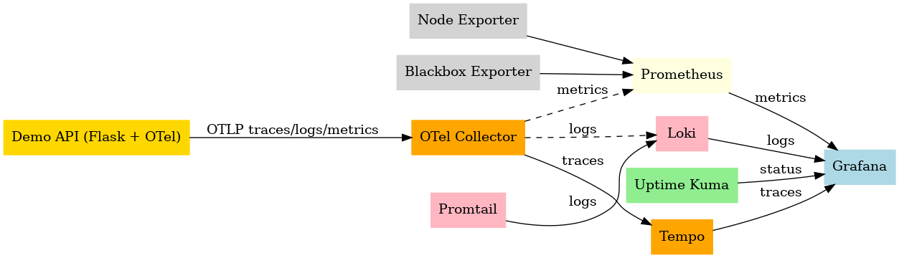

# Cloud-Native Observability Stack

🚀 A self-contained monitoring and observability stack built with Docker Compose — combining **high-performance metrics, synthetic checks, and automated dashboards** into one cohesive platform.

✨ **Overview**

This project provisions a full monitoring suite for containers and hosts. It emulates enterprise observability practices using **VictoriaMetrics** for high-performance storage and **Grafana Provisioning** for a "Stateless" dashboard experience.

**What it builds:**
* **Grafana** — dashboards & alerting (auto-provisioned)
* **Prometheus** — metrics scraping & alerting logic
* **VictoriaMetrics** — long-term time-series DB via Remote Write
* **Node Exporter** — host-level performance metrics
* **cAdvisor** — container resource usage & stats
* **Blackbox Exporter** — HTTP/ICMP/TCP synthetic probing

✅ **Stateless Configuration**: No manual dashboard imports. Everything is defined in code.
📈 **Performance-First**: VictoriaMetrics ensures minimal resource footprint for long-term data.

---

## 📊 Architecture



➡️ [**View scalable SVG version**](docs/architecture.svg)

---

## 🧠 Lessons Learned & Engineering Challenges

### 🏗️ Infrastructure as Code (IaC) with Terraform
I transitioned from manual VM configuration to managing the infrastructure lifecycle with **Terraform**. This shift taught me the critical nature of **state management** and how to use providers to ensure that the underlying cloud resources are as version-controlled and reproducible as the applications they host.

### 🛠️ Solving OCI Runtime & Volume Conflicts
A major technical hurdle involved refactoring the directory structure on a live stack. I encountered `OCI runtime create failed` errors—a result of Docker creating directories when it expected mountable files. 
**The Fix:** I performed a deep-clean of the Docker "shims" and implemented a centralized `config/` directory. This established a strict **Source of Truth** model, eliminating "ghost" directories and ensuring clean, predictable bind-mounts.

### 📊 Stateless Observability & Provisioning
To move away from manual "toil," I implemented **Grafana Provisioning**. By defining Data Sources and Dashboards in YAML/JSON, I removed the need for manual UI interactions. This ensures the stack is entirely "disposable"—it can be torn down and rebuilt in seconds without losing visibility.

### 📈 Metrics Scaling with VictoriaMetrics
I integrated VictoriaMetrics to act as the long-term storage backend. I learned to configure **Prometheus Remote Write** and gained experience managing a high-performance TSDB, focusing on reducing storage overhead and improving query latency compared to standard Prometheus retention.

---

## ⚡ Quick start

```bash
# 1. Provision Infrastructure
cd terraform && terraform apply

# 2. Launch the Stack
cd ..
docker compose up -d
🔍 Access
Grafana: http://localhost:3000 (Admin/Admin)

Prometheus: http://localhost:9090

VictoriaMetrics: http://localhost:8428

---

🛠️ Tech Stack

Containerization: Docker Compose

Infrastructure as Code: Terraform

Metrics: Prometheus, VictoriaMetrics

Exporters: Node Exporter, cAdvisor, Blackbox

Dashboards & Alerts: Grafana

Automation: Bash (Architecture-as-Code rendering)

---

📂 Repo Structure
---

monitoring-stack/
├─ config/              # Centralized Source of Truth
│  ├─ prometheus/       # Scrape configs & Alert rules
│  ├─ grafana/          # Auto-provisioned dashboards
│  └─ alertmanager/     # Notification logic
├─ docs/                # Architecture (DOT, PNG, SVG)
├─ scripts/             # Operational automation
├─ terraform/           # Base infrastructure (IaC)
├─ tools/               # SRE utility toolkit
├─ compose.yaml         # Service Orchestration
└─ Makefile             # Task automation
---

📜 License
MIT

Built by Tim Heverin (dj-3dub) Cloud Engineer / SRE If this project is useful, ⭐ the repo and say hi on GitHub.
