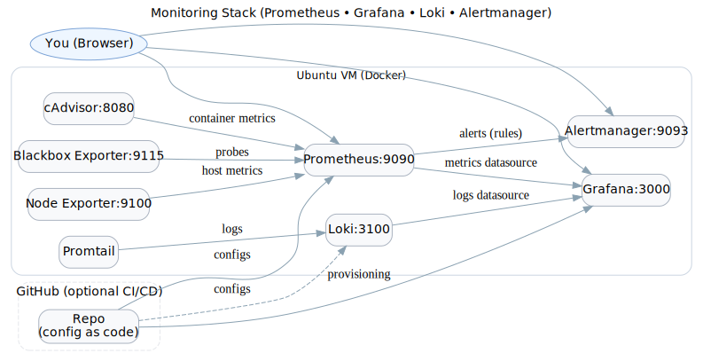

# Monitoring Stack

A modern observability stack for my homelab, built with Docker Compose.  
This project showcases **Linux**, **GitOps**, and **CI/CD** skills by combining **Prometheus, Grafana, Alertmanager, Loki, and Promtail** into a single stack.

---

## 🚀 Features
- **Prometheus**: Metrics collection and scraping.
- **Alertmanager**: Configurable alerts with routing.
- **Grafana**: Dashboards and visualizations, auto-provisioned from `config/grafana/`.
- **Loki + Promtail**: Centralized log aggregation.
- **Blackbox Exporter**: Probes for HTTP, TCP, ICMP checks.
- **Config-as-Code**: All configs live under `config/` and version-controlled.
- **Smoke Test**: `monitoring_smoke_test.py` verifies endpoints after deployment.

---

## 📂 Project Structure

config/
├── alertmanager/ # Alertmanager config
├── blackbox/ # Blackbox Exporter config
├── grafana/ # Grafana provisioning
└── prometheus/ # Prometheus config + rules
docker-compose.yml # Service definitions
monitoring_smoke_test.py # Automated smoke test script

## ⚙️ Deployment
```bash
git clone git@github.com:dj-3dub/monitoring-stack.git
cd monitoring-stack
docker compose up -d

🛠️ Skills Demonstrated

Linux VM setup & configuration

Docker Compose orchestration

Git/GitHub version control

GitOps-style configuration management

Observability best practices (metrics, logs, alerts)

CI/CD readiness (configs validated with Python smoke tests)

## 🗺️ Architecture

<p align="center">
  
</p>
